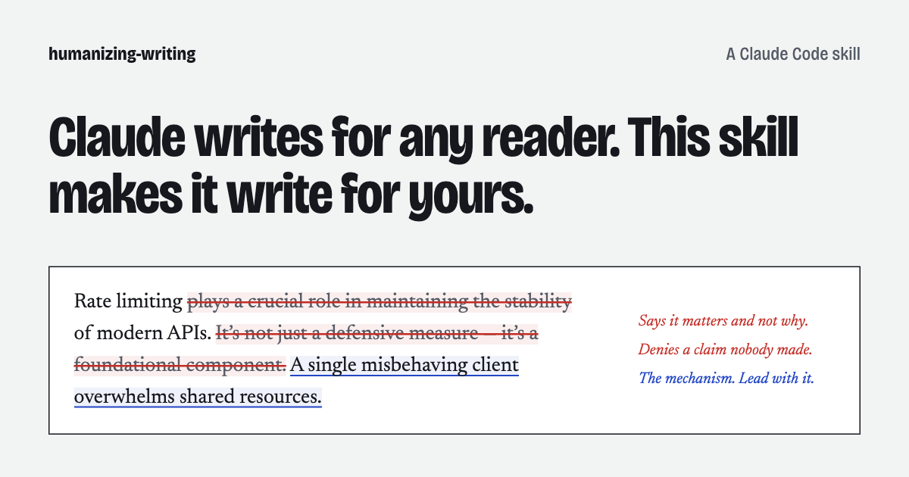

# humanizing-writing

[](https://github.com/AshwinSathian/humanize-writing-skill/releases) [](LICENSE) [](https://skills.sh/ashwinsathian/humanize-writing-skill) [](https://github.com/AshwinSathian/humanize-writing-skill)

A Claude Code skill that guides how Claude writes prose (docs, reports,
emails, posts, PR descriptions) so it doesn't read as machine-written.
It applies while Claude is writing, and also when you ask Claude to
humanize a draft. It does not change AI-detector scores.

[](https://humanize.ashwinsathian.com)

**[humanize.ashwinsathian.com](https://humanize.ashwinsathian.com)** ·
[AI writing tells in 2026](https://humanize.ashwinsathian.com/tells) ·
[Examples](https://humanize.ashwinsathian.com/examples) ·
[How it was tested](https://humanize.ashwinsathian.com/research) ·
[Compared with other skills](https://humanize.ashwinsathian.com/compare) ·
[FAQ](https://humanize.ashwinsathian.com/faq)

## Install

```bash
npx skills add AshwinSathian/humanize-writing-skill
```

Or, inside Claude Code:

```
/plugin marketplace add AshwinSathian/humanize-writing-skill
/plugin install humanizing-writing@humanize-writing-skill
```

Neither needs an account or a review. [More ways to install, and how to
check it's working](#install-details).

## Example

One of four worked examples in `examples/` (full annotations there):

**Before:**
> Rate limiting plays a crucial role in maintaining the stability and
> reliability of modern APIs. It's not just a defensive measure — it's a
> foundational component of good API design... Despite the added
> complexity it introduces, rate limiting remains a testament to
> thoughtful, resilient system design.

**After:**
> Rate limiting exists because one misbehaving client can overwhelm
> resources that every client shares, and the failure then spreads to all
> of them. With a limit in place, that client's extra requests are
> rejected (HTTP 429) and the others keep working... It also makes the
> API more complex.

The rewrite states the mechanism the original buried, and adds no fact
the original did not have. `examples/` also has two 2026-style drafts
(one all fragments and "load-bearing", one a single 61-word sentence)
and a note in each file on what the 1.x rewrite got wrong.

## What it tells Claude

Text reads as machine-written when every choice in it would suit any
reader and any subject. The eleven rules in `SKILL.md` point Claude at
this reader and this subject:

- **Claims.** Specific and checkable: the number, the command, the
  file, the error text. Each thing said once.
- **Words.** The plain verb and the common word, and the fact where a
  figure of speech was standing in for it.
- **Sentences.** Length follows the content. Asides go in commas or
  parentheses. A doubtful claim gets one hedge.
- **Endings and structure.** Stop when the content stops. Lists for
  what a reader scans, paragraphs for the rest.

One rule never yields: Claude does not invent a figure, quote,
incident, or source to sound specific. The others are defaults, and
`SKILL.md` names ten cases where they give way, among them API
reference, legal text, fiction, marketing copy, someone else's writing,
and your own voice.

## What it doesn't do

**It is written for human readers and does not get text past AI
detectors.** Current detectors are trained classifiers that key on how
an instruction-tuned model writes, which a style guide does not change
(`reference/research/2026-update.md` §3). If you need a detector score,
this is the wrong tool.

It also doesn't ban words. An em dash is fine where a comma would hide
the break, and "delve" is fine where you mean it.

## Tested blind

Fresh Claude instances wrote three pieces with no skill, with version
1.1.1, and with the current rules. Model judges read shuffled pairs
with no labels and said which they would rather publish. Sonnet and
Opus wrote the first round (2.0.0, 12 pairs). Haiku wrote the second
(2.1.0, 6 pairs), which added a Haiku judge.

| Skill preferred over no skill | Opus judge | Sonnet judge | Haiku judge |
|---|---|---|---|
| Sonnet and Opus writing | 5 of 6 | 5 of 6 | not run |
| Haiku writing | 3 of 3 | 3 of 3 | 3 of 3 |

| Skill preferred over 1.1.1 | Opus judge | Sonnet judge | Haiku judge |
|---|---|---|---|
| Sonnet and Opus writing | 5 of 6 | 4 of 6 | not run |
| Haiku writing | 3 of 3 | 2 of 3, one tie | 2 of 3 |

In the first round it lost the pull request description to the
no-skill passage with both judges: the 2.0.0 one was a "Summary" and
"Changes" skeleton whose bullets repeated the summary. In the Haiku
round, two of three judges flagged the skill's feature-flag passage for
stating the team's current practice as fact, which the rule against
inventing should have stopped.

The samples are small, the judges are Claude models, and the rules were
revised after earlier drafts did badly on the same three tasks. The
pairs, the keys, the losses, and the limits are in
`reference/validation-note.md`.

## Why this one

Most public humanizer skills reduce to a banned-word list: swap "delve"
for something else, cap em dashes, and call it done. That works until
the list goes stale, and it goes stale fast (`reference/research.md`
§3). Wikipedia's own list of AI vocabulary is now sorted by model era,
and its list for mid-2025 onward is four words, one of which was on its
2023 list.

The tells have moved since 2023. Current models have mostly dropped
"delve" and now show long noun-heavy sentences, metaphor in place of
plain statement, and short closing lines written for effect. Version
1.x of this skill did not cover those, and its own rewritten examples
contained some of them. Version 2.0.0 (October 2026) rewrote the rules
against 2026 sources. `reference/research/2026-update.md` has the
detail.

| | This skill | The widely used alternatives |
|---|---|---|
| When it runs | While Claude writes, and on request over a draft | Over a finished draft |
| Loaded per use | About 1,150 words | About 4,200 words (blader/humanizer) |
| Genre handling | Ten named cases in a Scope section | One paragraph, or none |
| Testing | 18 blind pairs over two rounds, Claude judges | blader/humanizer reports 16 of 16 in a blind preference test |

The last row is where this skill is weaker, and
[blader/humanizer](https://github.com/blader/humanizer) is the better
choice if you want the best-tested rewrite tool.
`reference/oss-skills-review.md` has the teardown of 13 public skills
and what this one took from them.

## Your own voice

Since 2.1.0, when Claude drafts in your voice from a writing sample or
a voice profile, your habits outrank the style rules. If you use
dashes, rhetorical questions, or "not X but Y", the draft does too, at
about your rate. `voices/ashwin-sathian.md` is a worked profile: one
author's habits as counts and descriptions, with no quoted text. It
gets stance and person right and rhythm only partly; the file lists the
misses.

## Install details

<details>
<summary>Symlinked clone, try without installing, verify, uninstall</summary>

**As a symlinked clone.** Clone the repo, then symlink it into your
Claude Code skills directory:

```bash
git clone https://github.com/AshwinSathian/humanize-writing-skill.git
ln -s "$(pwd)/humanize-writing-skill" ~/.claude/skills/humanizing-writing
```

The symlink means editing the cloned repo updates the live skill
directly: pull to update, no reinstall step.

**Try it without installing anything:**

```bash
claude --plugin-dir /path/to/humanize-writing-skill
```

**About the plugin marketplace.** The repo ships both a
`.claude-plugin/plugin.json` manifest and a
`.claude-plugin/marketplace.json`, so it's a self-contained plugin
marketplace of one. It is not submitted to Anthropic's official
community marketplace (`@claude-community`), which requires a
submission review. This repo's own marketplace gets you the same
install at the price of one extra `marketplace add` command.

**Verify it's working.** After installing, ask Claude something like
"what skills do you have available?" or give it a short, obviously
AI-toned paragraph and ask it to write something similar. A working
install should visibly avoid the tells in `SKILL.md`'s quick-reference
table. The skill triggers on prose of a paragraph or more; it is not
meant to fire on a one-line commit subject or a chat reply. If it
doesn't trigger: for the symlink method, confirm it resolves
(`ls -la ~/.claude/skills/humanizing-writing`); for `--plugin-dir`,
confirm the flag points at this repo's root, not a subdirectory; for
the marketplace method, run `/plugin list` and confirm
`humanizing-writing@humanize-writing-skill` shows as enabled.

**Uninstalling.** Symlink: remove it
(`rm ~/.claude/skills/humanizing-writing`). `--plugin-dir`: drop the
flag. Marketplace install:
`/plugin uninstall humanizing-writing@humanize-writing-skill`, and
`/plugin marketplace remove humanize-writing-skill` if you added the
marketplace only for this. None of these leave other state behind. To
disable it for one request without uninstalling, tell Claude directly.
Per `SKILL.md`'s own "Scope" section, an explicit user instruction
overrides the skill's defaults.

</details>

## What's in here

```
.claude-plugin/plugin.json     # plugin manifest (validated, claude plugin validate . --strict)
.claude-plugin/marketplace.json # self-hosted marketplace, one plugin: this one
SKILL.md                       # the skill itself, lean and always-loadable
CHANGELOG.md                   # what changed each version, and why
reference/research.md          # research synthesis: what the literature actually says
reference/research/2026-update.md # newer sources behind 2.0.0, and the 1.x claims they weakened
reference/claude-tics.md       # habits of current Claude models, dated, with evidence tiers
reference/oss-skills-review.md # teardown of 13 existing public humanizer skills
reference/research/            # raw, fully-cited research reports (academic, editorial, tells catalog, OSS survey)
reference/validation-note.md   # blind comparisons against no skill and against 1.1.1 on Haiku, Sonnet, and Opus, with the losses
reference/validation-2.0.0/    # the blind pairs, the key, both judges' answers, the adversarial review
reference/validation-2.1.0-haiku/ # the Haiku round: passages, pairs, key, three judges' answers, prompts, scripts
examples/                      # worked before/after passages with annotated fixes
voices/                        # an example voice profile: one author's habits as numbers and descriptions, no quoted text
scripts/measure.py             # descriptive prose metrics for comparing passages (stdlib, no verdicts)
site/                          # source of humanize.ashwinsathian.com (Next.js static export); not part of the skill
```

`SKILL.md` stays short on purpose: it loads into context whenever the
skill triggers. The `reference/` directory carries the depth: full source
citations, credibility notes, and the reasoning behind every design
decision, so nothing in `SKILL.md` has to be taken on faith.

## Research

It's built from three research passes (academic detection literature,
editorial and practitioner style guides, and a cross-referenced catalog
of 27 specific AI-writing tells), a teardown of 13 existing public
humanizer skills, and three adversarial review rounds.

`reference/research.md` is the entry point, with
`reference/research/2026-update.md` as its correction for current
models. The first is a synthesis of stylometry and
AI-text-detection research (DetectGPT, Binoculars, watermarking studies,
lexical-marker research on the "delve" phenomenon), Wikipedia's
crowd-audited "Signs of AI Writing" essay, and classic prose craft guidance
(Orwell, Strunk & White). It also documents where "sound human" advice
conflicts with good writing and resolves in favor of the latter: this
skill never bans ordinary correct vocabulary, never states an invented
numeric threshold, and never asks Claude to add unearned specifics.

Two essays cover the thinking at more length:
[Why word lists fail](https://ashwinsathian.com/writing/why-humanize-my-writing-tools-dont-work)
(August 2026) and
[What changed in 2.0.0, and why](https://ashwinsathian.com/writing/the-ai-tells-moved-my-tool-for-avoiding-them-hadnt)
(October 2026).

## Something read wrong, or didn't apply?

This skill makes judgment calls, and judgment calls are sometimes wrong.
A prior adversarial round caught it stripping a marketing page's closing
line before that got fixed (`reference/validation-note.md` has the full
account, including the miss). If it mangles something, [open an
issue](https://github.com/AshwinSathian/humanize-writing-skill/issues/new/choose)
with the before/after text; that's more useful than a star. Pull requests
that add a sourced tell, a genre gap, or a false-positive case are
welcome. The bar is the same one this skill holds itself to: trace it to
something real, not a hunch.

This README and the project site were written with the skill.

## License

MIT. See `LICENSE`.
